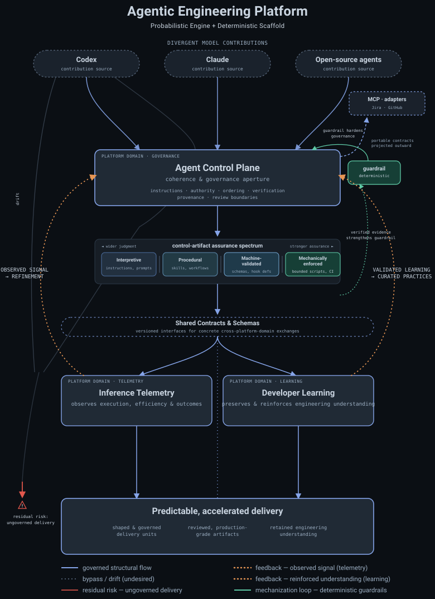

# Agentic Engineering Platform

The Agentic Engineering Platform is an AI-native internal developer platform for
governing, observing, and improving AI-assisted engineering workflows. It
brings together reusable agent-governance infrastructure, execution telemetry,
engineering tools, and evidence from real human-AI workflows.

## Platform Model

The platform operates as a feedback loop across three peer components:

1. The **Agent Control Plane** turns human intention into governed execution
   through instructions, skills, policies, runtime adapters, and explicit task
   authority.
2. **Inference Telemetry** observes that execution and analyzes events from
   multiple authoritative producers. The Agent Control Plane produces
   governance and instruction evidence, while runtime providers produce model,
   usage, latency, and trace telemetry; each producer retains ownership of its
   native event semantics and provenance.
3. **Developer Learning** converts validated execution signals into reinforced
   understanding and reusable improvements.

Shared Contracts & Schemas connect the components. Telemetry findings and
validated learning feed back into the Agent Control Plane, strengthening the
next cycle of governed execution.



> [!NOTE]
> This repository does not require dedicated server infrastructure for its core functionality.

## Interaction Model

```text
developer → Codex / Claude / Copilot
                    ↓ runtime discovery
          instructions · skills · hooks · policies
                    ↓
             governed agent behavior
```

***Wherever a developer works through a supported agent, AEP can provide the
ambient, event-driven policy layer.*** Developers continue working with Codex,
Claude, or Copilot through natural-language requests. Once AEP is installed,
the runtime discovers repository guidance, the agent selects relevant skills,
and hooks respond to lifecycle events. AEP commands remain an administrative
surface for bootstrap, validation, diagnostics, and maintenance rather than the
normal product interface.

## Operator Commands

Normal agent use requires no AEP command. Run these from the repository root
when setting up, validating, or maintaining the platform itself.

### Set up the maintainer environment

```bash
python3 -m venv platform/agent-control-plane/.venv
platform/agent-control-plane/.venv/bin/python -m pip install -e "platform/agent-control-plane[validation]"
git config --local core.hooksPath .githooks
```

Creates the isolated validation environment and enables this clone's Git
guardrails.

### Validate control-plane assets

```bash
platform/agent-control-plane/.venv/bin/python platform/agent-control-plane/scripts/validate_asset_registries.py
```

Checks canonical hook, skill, instruction, and contract registries, including
schema validity and required evidence producers.

### Run control-plane tests

```bash
platform/agent-control-plane/.venv/bin/python -m unittest discover -s platform/agent-control-plane/tests
```

Runs the focused regression suite for contracts, hooks, adapters, and governed
workflow tooling. See the
[operator script guide](platform/agent-control-plane/scripts/README.md) for
targeted diagnostics and maintenance commands.

### Enforce the same checks in CI

`.github/workflows/control-plane-guards.yml` runs the discovery-layout,
registry, contract, adapter-freshness, and test guards on every pull request to
`main`. Its `control-plane-guards` job is the required status check on `main`,
so the commands above are a fast local preview of a gate that runs anyway
rather than a step someone has to remember. See
[Control Plane Guards in CI](platform/agent-control-plane/docs/control-plane-guards-ci.md).

The ordered follow-on gate requests Copilot only after those guards pass and
reports an exact-head `aep-copilot-review` check. A new push invalidates the
previous review; actionable or unrecognized findings block readiness, while
explicit disputes remain visible for human judgment. See
[Ordered Copilot review gate](platform/agent-control-plane/docs/copilot-review-gate.md).

## Agent Behavior Smoke Test

After the deterministic checks pass, open the clone in any supported agent and
submit these read-only prompts. Compare the expected signals rather than exact
wording; agent output varies by runtime and model.

1. **Instruction discovery**

   ```text
   Without modifying anything, explain which repository instructions govern
   this session and report their instruction references.
   ```

   Expected: discovers the repository guidance, remains read-only, and returns
   the instruction manifest.

2. **Workflow routing**

   ```text
   Explain how this repository handles a bounded Jira task compared with
   exploratory, cross-cutting agent work. Do not change Git state.
   ```

   Expected: distinguishes direct Jira-keyed delivery from the recommended
   `workbench/local` capture-and-shaping path.

3. **Authority boundaries**

   ```text
   I want to publish a repository change. Before taking action, explain which
   Git, GitHub, and Jira operations require explicit authorization.
   ```

   Expected: separates implementation, commit, push, pull request, merge,
   cleanup, and Jira authority without mutating any system.

These prompts are manual runtime smoke checks, not deterministic CI tests.

### Planned adopter-repository scenario

The next smoke-test layer will instantiate a small, versioned codebase in a
disposable directory, install AEP's runtime-native surfaces, initialize Git,
and open the result as a new agent session. Keeping it outside this checkout
prevents the monorepo's own instructions from contaminating the adopter test.

The scenario will contain a few source modules, focused tests, local guidance,
and one seeded cross-module request. Its first prompt will remain read-only:

```text
Inspect this repository without modifying it. A developer wants to add dry-run
support to report generation. Explain the current behavior, identify the
affected modules and tests, and propose the smallest coherent implementation
boundary.
```

Expected signals include discovery of the installed AEP guidance, accurate
interpretation of unfamiliar code, bounded scope, focused verification, and
preserved authority. An optional follow-up may authorize implementation and
tests inside the disposable repository without authorizing commit or
publication.

This fixture and its bootstrap command are not implemented yet; scope them as
a governed Jira task before implementation.

## Governed Git Delivery Workflow

The Agent Control Plane governs how agent-assisted repository work moves from
evolving local intent into bounded Jira outcomes, reviewable Git branches, and
accepted changes on `main`.

For ongoing agent co-programming, `workbench/local` is the recommended,
first-class capture-and-shaping path, especially when work may cross contexts,
files, modules, or delivery boundaries. It remains optional: when a Jira
outcome is already bounded, developers may follow the conventional path by
creating its delivery branch directly from current `main`. In either path,
Jira-keyed branches contain one reviewable outcome and merge through pull
requests; the workbench never advances `main`. A branch ruleset holds that
boundary on the remote: merging into `main` requires the `control-plane-guards`
check and an accountable human review, alongside an automatic Copilot review
that comments but approves nothing. See the
[governed repository delivery guide](docs/operations/governed-repository-delivery.md).

## Repository Structure

```text
agentic-engineering-platform/
├── AGENTS.md                         # Shared agent guidance (required)
├── CLAUDE.md                         # Claude Code routing adapter
├── .agents/skills/                   # Codex Agent Skill discovery links
├── .codex/                           # Codex project config and hooks
├── .claude/                          # Claude Code rules, skills, and hooks
├── .github/                          # Copilot definitions, hooks, CI workflows
├── .githooks/                        # Repository Git guardrails
├── .mcp.json                         # Repository MCP server configuration
├── platform/                         # Canonical platform components
│   ├── agent-control-plane/           # Governed instructions and execution
│   │   ├── adapters/                  # Runtime and destination integrations
│   │   ├── agent-assets/              # Portable policies, instructions, skills
│   │   ├── contracts/                 # Control-plane interfaces
│   │   └── scripts/                   # Component validation and automation
│   ├── inference-telemetry-observatory/ # Usage and execution observations
│   └── developer-learning-retrieval/  # Learning signals from engineering work
├── evidence/                         # Applied human-AI workflow evidence
│   └── human-ai-collaboration-case-studies/
├── shared/                           # Cross-component contracts and tooling
│   ├── schemas/
│   ├── contracts/
│   └── tooling/
├── docs/                             # Architecture, diagrams, and operations
│   ├── architecture/
│   ├── diagrams/
│   ├── operations/
│   └── glossary.md
├── future/                           # Shaped but not implemented change plans
└── scripts/                          # Repository-wide automation
```

### Platform domains

- [`platform/agent-control-plane/`](platform/agent-control-plane/) governs
  instruction discovery, runtime adapters, provenance, reusable skills,
  governed action routing, and auditable agent execution.
- [`platform/inference-telemetry-observatory/`](platform/inference-telemetry-observatory/)
  measures model usage, latency, token economics, and agent execution
  behavior.
- [`platform/developer-learning-retrieval/`](platform/developer-learning-retrieval/)
  converts engineering activity into retrieval-practice and learning signals.

### Supporting boundaries

- [`AGENTS.md`](AGENTS.md), [`.agents/`](.agents/), [`.codex/`](.codex/),
  [`.claude/`](.claude/), [`.github/`](.github/), [`.githooks/`](.githooks/),
  and [`.mcp.json`](.mcp.json) are repository-root runtime-native installation
  and guardrail surfaces. Their portable contracts, canonical assets,
  adapters, and design documentation remain owned by the Agent Control Plane
  component.
- [`evidence/`](evidence/) contains applied human-AI collaboration case studies
  used to validate and improve the platform.
- [`shared/`](shared/) owns cross-domain schemas, contracts, and reusable
  tooling that connect multiple pillars or do not belong to a single platform
  component. Potential reuse alone is not enough; at least two pillars must
  share the artifact's lifecycle or interface.
- [`docs/`](docs/) separates architecture, diagrams, and operations material;
  [`future/`](future/) holds shaped change plans that are not implemented.
- [`scripts/`](scripts/) is reserved for repository-wide integration and
  maintenance automation. Component-specific scripts remain with their owning
  platform pillar.

## Local Knowledge Overlay

Personal engineering notes may be mounted locally through the repository-root
`engineering-knowledge-base` symlink. This machine-specific overlay is
intentionally excluded from the canonical repository and does not define
product requirements or runtime contracts. The tracked public design surface
remains
[`docs/architecture/engineering-knowledge-base.md`](docs/architecture/engineering-knowledge-base.md).


## Repository History

This monorepo preserves the commit histories of the original component
repositories. The parent repository is now the canonical integration point
for cross-component documentation, development, and future releases.

## License

Source available for viewing, but not open source. No permission is granted to
use, copy, modify, or redistribute the current version except as permitted by
law or with prior written permission. See [LICENSE](LICENSE) for details,
including treatment of earlier Apache-2.0 versions and third-party materials.
