# Filename Propagation Reasoning Trace

```mermaid
flowchart LR
    A["Start: Filename propagation<br/>with underscore cleanup"] --> B["Inventory every immediate child<br/>of ~/Projects/dev"]

    B --> C["Filter to Git repositories only"]
    C --> D["Match repos where directory name<br/>or GitHub repo name contains underscores"]

    D --> E["Map incoming references<br/>across repos"]

    E --> F["Execute in dependency-safe order"]
    F --> F1["1) Rename GitHub repository"]
    F1 --> F2["2) Update local remote URL<br/>(for example origin)"]
    F2 --> F3["3) Rename local directory"]
    F3 --> F4["4) Rewrite cross-repository<br/>references"]

    F4 --> G["Leave untouched:"]
    G --> G1["Non-Git directories"]
    G --> G2["Names without underscores"]

    G1 --> H["Outcome: scoped, ordered,<br/>low-breakage propagation"]
    G2 --> H
```

## Glossary Note: "Local remote"

In Git, a remote is a named URL stored in your local repository config.

- Example: `origin` -> `git@github.com:Oak-22/agentic-engineering-platform.git`
- It is local metadata in `.git/config`, not a branch and not a place commits live.
- Your commit is first stored locally on your current branch.
- A commit goes to GitHub only when you push to a remote branch.
