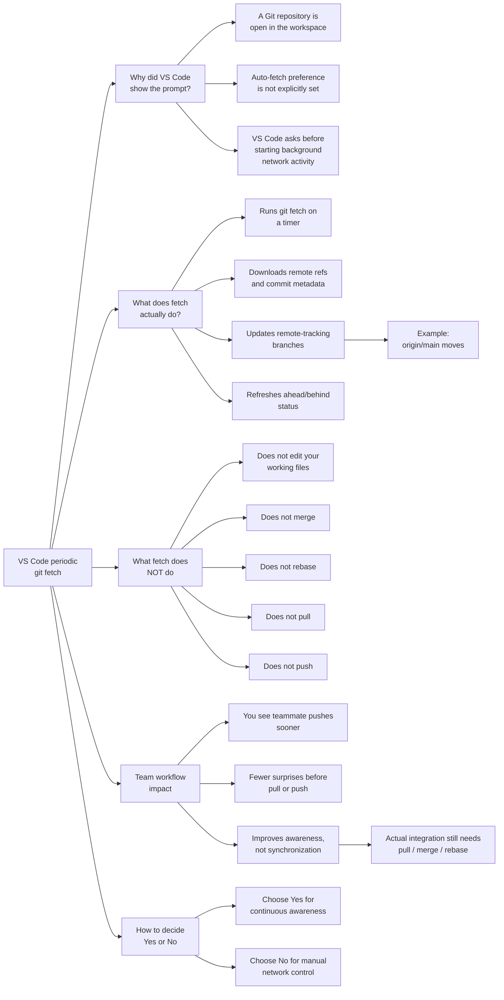

# Git Fetch Explainer Diagram

```mermaid
flowchart LR
    A["VS Code periodic<br/>git fetch"] --> B["Why did VS Code<br/>show the prompt?"]
    A --> C["What does fetch<br/>actually do?"]
    A --> D["What fetch does<br/>NOT do"]
    A --> E["Team workflow<br/>impact"]
    A --> F["How to decide<br/>Yes or No"]

    B --> B1["A Git repository is<br/>open in the workspace"]
    B --> B2["Auto-fetch preference<br/>is not explicitly set"]
    B --> B3["VS Code asks before<br/>starting background<br/>network activity"]

    C --> C1["Runs git fetch on<br/>a timer"]
    C --> C2["Downloads remote refs<br/>and commit metadata"]
    C --> C3["Updates remote-tracking<br/>branches"]
    C3 --> C4["Example:<br/>origin/main moves"]
    C --> C5["Refreshes ahead/behind<br/>status"]

    D --> D1["Does not edit your<br/>working files"]
    D --> D2["Does not merge"]
    D --> D3["Does not rebase"]
    D --> D4["Does not pull"]
    D --> D5["Does not push"]

    E --> E1["You see teammate pushes<br/>sooner"]
    E --> E2["Fewer surprises before<br/>pull or push"]
    E --> E3["Improves awareness,<br/>not synchronization"]
    E3 --> E4["Actual integration still needs<br/>pull / merge / rebase"]

    F --> F1["Choose Yes for<br/>continuous awareness"]
    F --> F2["Choose No for manual<br/>network control"]
```
