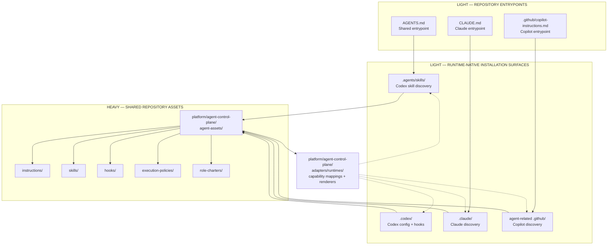

# Agent Asset Discovery Layers

This diagram shows how agent guidance moves through four layers:

1. **Repository entrypoints** — shared files such as `AGENTS.md`.
2. **Runtime surfaces** — provider-specific discovery locations such as
   `.codex/`, `.claude/`, and `.github/`.
3. **Provider adapters** — runtime mappings and renderers.
4. **Canonical agent assets** — reusable instructions, skills, hooks,
   policies, and role charters.

The first two layers stay lightweight. The canonical assets contain the
substantive reusable behavior.

It explains ownership and routing; it is not the conformance check. Validate
the live layout with [`scripts/check-agent-discovery-layout.sh`](../../../scripts/check-agent-discovery-layout.sh).

