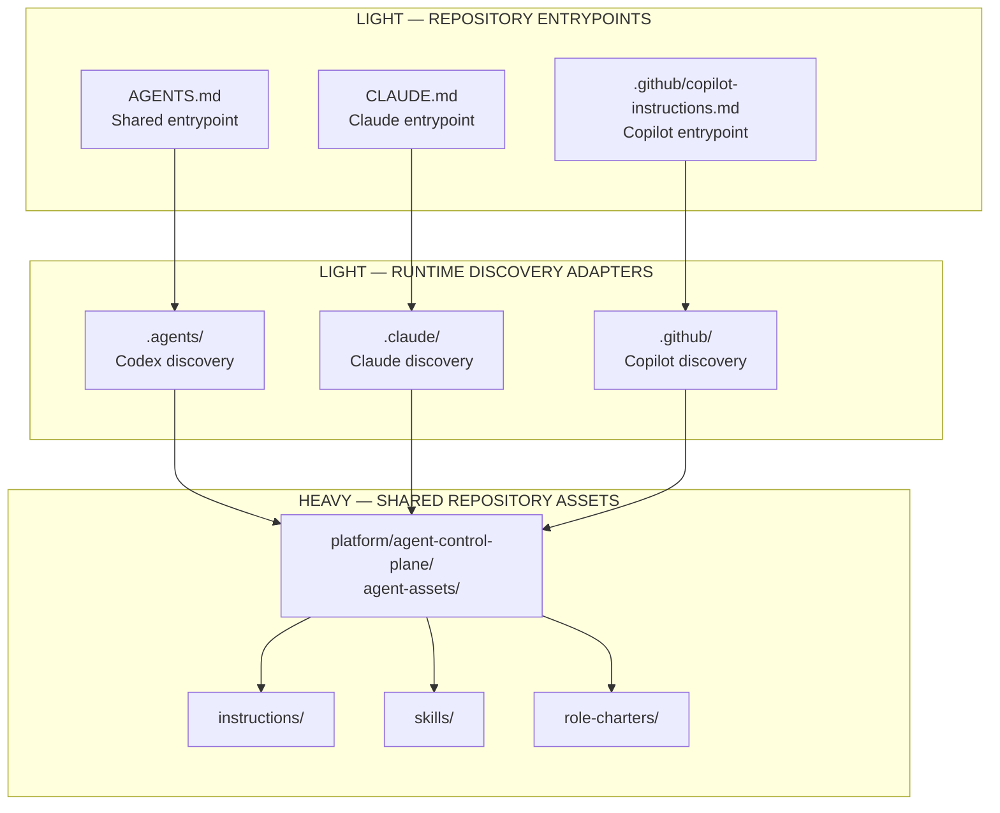

# Agent Asset Discovery Layers

This diagram separates lightweight repository entrypoints and runtime
adapters from canonical skill packages and other shared agent assets.

```mermaid
flowchart TB
    subgraph E["LIGHT — REPOSITORY ENTRYPOINTS"]
        direction TB
        ES[" "]

        subgraph ER[" "]
            direction LR
            A["AGENTS.md<br/>Shared entrypoint"]
            C["CLAUDE.md<br/>Claude entrypoint"]
            G[".github/copilot-instructions.md<br/>Copilot entrypoint"]
        end
    end

    subgraph D["LIGHT — RUNTIME DISCOVERY ADAPTERS"]
        direction TB
        DS[" "]

        subgraph DR[" "]
            direction LR
            DO[".agents/<br/>Codex discovery"]
            DC[".claude/<br/>Claude discovery"]
            DG[".github/<br/>Copilot discovery"]
        end
    end

    subgraph S["HEAVY — SHARED REPOSITORY ASSETS"]
        direction TB
        SS[" "]
        ROOT["platform/agent-control-plane/<br/>agent-assets/"]

        subgraph SR[" "]
            direction LR
            I["instructions/"]
            K["skills/"]
            R["role-charters/"]
        end
    end

    A --> DO
    C --> DC
    G --> DG

    DO --> ROOT
    DC --> ROOT
    DG --> ROOT

    ROOT --> I
    ROOT --> K
    ROOT --> R

    style ES fill:transparent,stroke:transparent
    style DS fill:transparent,stroke:transparent
    style SS fill:transparent,stroke:transparent

    style ER fill:transparent,stroke:transparent
    style DR fill:transparent,stroke:transparent
    style SR fill:transparent,stroke:transparent
```
