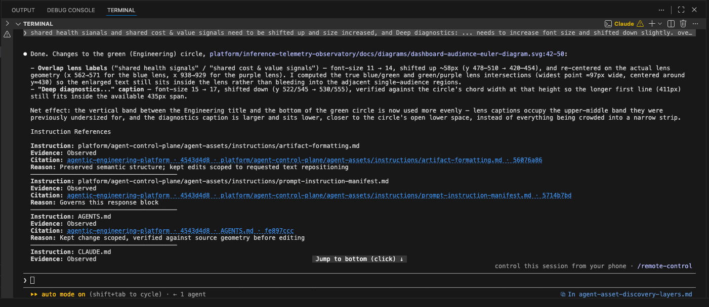

# Instruction evidence store

The instruction-evidence store is generated local runtime evidence. It is not
an authored repository knowledge base and it does not contain prompt text.
Canonical data is kept outside the repository, partitioned by repository
identity. The ignored `.aep/instruction-evidence` path is a project-local view
of that partition.

*The response-level instruction references connect a human-readable answer to
the evidence record that supports it.*

The generated `store-index.json` is the machine-readable description of this
layout and is validated by
[`instruction-evidence-store.schema.json`](../contracts/instruction-evidence-store.schema.json).

## How humans use the instruction references

Every completed prompt response includes a compact `Instruction References`
table. It tells the reader which instruction sources governed that response,
what kind of evidence supports each source, and where the supporting runtime
record can be inspected.

The table is a response-facing summary, not a transcript of the prompt or a
dump of the evidence store. Its evidence labels have distinct meanings:

- `Observed`: the runtime emitted an authoritative instruction-load event.
- `Runtime baseline`: repository discovery rules identify the instruction as
  active for the current scope.
- `Explicitly invoked`: the user named the skill or instruction for the turn.
- `Read during turn`: the agent opened and applied the instruction during the
  turn.
- `Declared`: a runtime adapter requires the instruction, but exposes no
  authoritative load event.

Use the citation in the same row as the evidence label. A citation is only
valid for the evidence record that produced it; when no structured record
exists, the citation is reported as `Unavailable` rather than inferred.

The response contract lives in
[`prompt-instruction-manifest.md`](../agent-assets/instructions/prompt-instruction-manifest.md).
The store retains the underlying local records so a reviewer can inspect the
evidence when a citation-dependent response, incident, or reproducibility
record still depends on it.

## Record taxonomy

| Path pattern | Kind | Scope | Runtime source | Lifecycle |
| --- | --- | --- | --- | --- |
| `repository.json` | Generated metadata | Project | Hook storage initialization | Safe to recreate; safe to retain or delete with the partition |
| `store-index.json` | Generated index | Project | Hook storage initialization | Safe to recreate; safe to retain or delete with the partition |
| `<session-id>.jsonl` | Generated session ledger | Session | Runtime is recorded in each event | Append-only during a session; safe to rotate or delete after citation-dependent work is complete |

The session identifier may be a UUID or a human-readable diagnostic name.
That naming difference does not imply a different authority or retention class.

Each session ledger may contain multiple events:

- `instruction_loaded`: a runtime observation of an instruction load. Claude
  Code emits these through its `InstructionsLoaded` hook event; the event may
  carry a prompt identifier when the runtime supplies one.
- `prompt_manifest`: one compact instruction-reference manifest for a submitted
  prompt or turn. It records the runtime and the typed evidence records used to
  render the response contract.

Therefore, a JSONL file is session-scoped, while `prompt_manifest` events are
prompt-scoped. The filename alone cannot identify the runtime or the number of
prompts it contains; inspect its events.

No authored artifacts are expected in this store. Tests and diagnostics may
use human-readable session identifiers, but those files remain generated
runtime evidence.

## Retention guidance

Retain a session ledger while a response citation, incident investigation, or
reproducibility record depends on it. Rotate or delete ledgers when that
dependency has ended. The project view is disposable: removing it does not
remove canonical data, and removing the canonical partition removes only local
runtime evidence, not repository source or prompt text.

The store index is descriptive metadata, not an audit record. It may always be
regenerated from the hook implementation and the schema.
