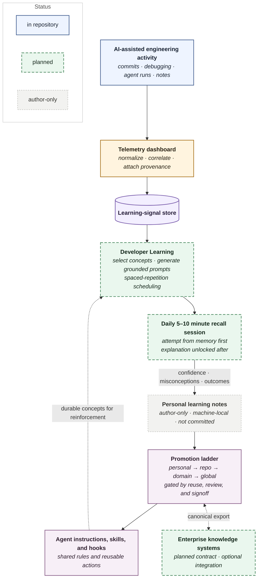

# Developer Learning

Status: **Planned — design only**

This planned service will use real local development telemetry, including
commits, debugging sessions, and agent runs, to create a daily five-to-ten-minute
review quiz through Codex or another supported agent. Questions will draw on
the developer's actual work and practice recalling concepts from memory
(retrieval practice).

## Intended Responsibilities

- consume learning signals from commits, debugging sessions, agent runs,
  and telemetry
- select concepts that merit reinforcement
- generate questions grounded in the developer's actual work
- schedule questions using spaced-repetition intervals
- require an unaided recall attempt before revealing explanations
- record confidence, misconceptions, and later retrieval outcomes
- promote durable insights into reviewed shared scope

## Platform Relationships

*Summary view; border style carries status, per the diagram's own legend.
Bold names the component, italics its responsibilities. Personal learning
notes stay with their author and are never committed. No scheduler, quiz
engine, or persistence layer is implemented; see Implementation Boundary.
The block above is the canonical source; regenerate
[`developer-learning-retrieval-in-context.svg`](docs/diagrams/developer-learning-retrieval-in-context.svg)
from it after any edit.*

The service design is documented in [`design.md`](docs/design.md).

Deferred feature concepts:

- [Shared Shell Assistance Gradient](features/shared-shell-assistance-gradient.md)
  explores three assistance interfaces over one continuous shell session as a
  source of learning and retention signals.

## Implementation Boundary

No scheduler, quiz engine, Codex automation, or user interface has been
implemented yet, and no learning signals are consumed from commits,
debugging sessions, or telemetry. Nothing in this directory runs. It
establishes the planned service boundary without overstating its maturity.
